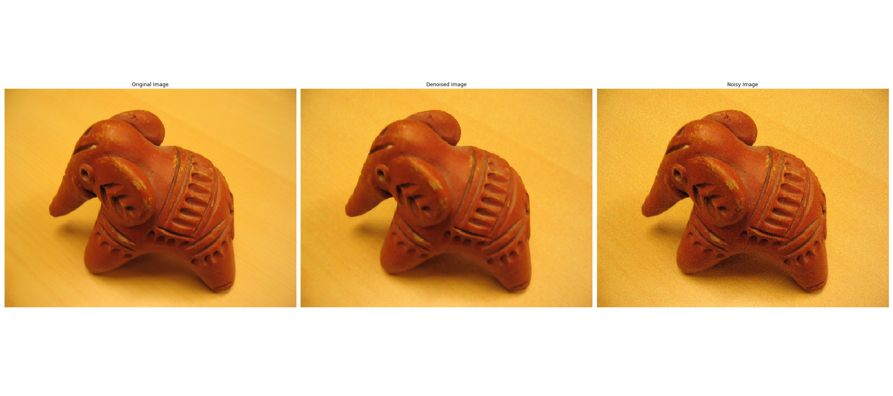

# Denoising MRF

Approximate Denoising MRF Implemented in Python using Iterated Conditional Modes for Input with Gaussian Noise. The loss function used is a `truncated` $\kappa$ `abs` loss ($\kappa$ is the power of the abs, for $\kappa=2$ this is MSE) which allows for smoother interiors and sharper edges on the objects. 

## Requirements
The following Python libraries are required:
1. Cupy (or Numpy, but it is slower)
2. Matplotlib
3. Tqdm

## How to Run
The `denoising-mrf.ipynb` notebook has all the functions and how to run the code. It also provides a report as to why ICM was chosen over a optimal solution with a convex loss function (say like MSE).

## Results

The above image shows the comparison for a simple image with Gaussian Noise added to it and the results of the algorithm. The notebook also has another example.